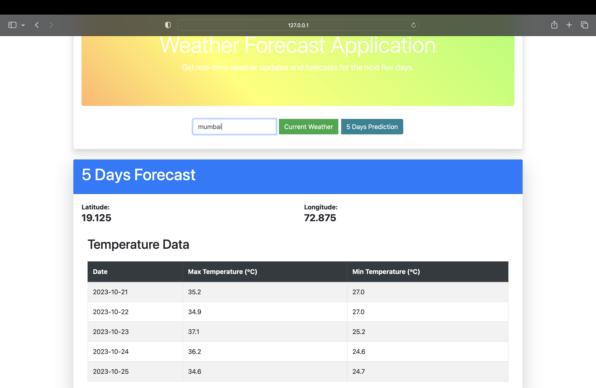

# Weather Information App

[](https://github.com/AKXAT/WeatherForecast)

The Weather Information App is a simple web application built using Flask, Jinja2, and Bootstrap. It provides users with real-time weather data, including latitude, longitude, temperature, and a visual representation of the temperature in the form of emojis. The app offers an intuitive and aesthetically pleasing interface for accessing weather information.

## Screenshots

### Home Page


### Current Weather


### 5-Day Weather Forecast


## Features

- Detailed display of latitude and longitude information in a user-friendly format.
- Real-time current weather conditions with temperature represented by emojis.
- Accurate predictions for the maximum and minimum temperatures over the next 5 days.
- Extensible city database: You can add more cities by updating the `backend/cities.json` file.
- Weather data provided by the [https://open-meteo.com](https://open-meteo.com) API.

## Getting Started

To run the Weather Information App on your local machine, follow these steps:

1. Clone the repository:

   ```bash
   git clone https://github.com/yourusername/weather-information-app.git
   cd weather-information-app

2. run the command `make setup` to install the depedencies
3. run the commnd `python3 app.py`
4. Now you can access the Weather Information App in your web browser by visiting http://localhost:5000.

Feel free to explore real-time weather data and forecasts for any location you desire with this user-friendly application!
